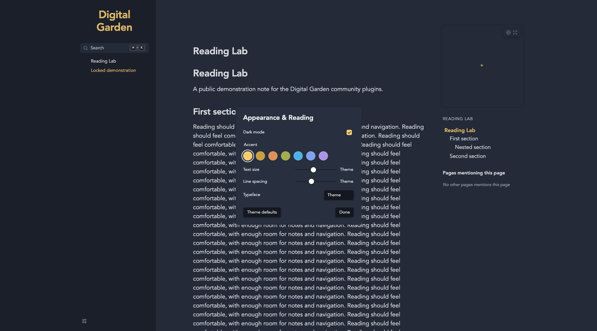

# Appearance & Reading

Theme-aware light/dark mode, generated accent colors, text size, line spacing and typeface in one compact menu.

## Installation

In Obsidian: Settings > Digital Garden > Plugins > Manage plugins > Browse & install. Until listed in the community gallery, use Install from GitHub with `koltensaccount/garden-plugin-theme-toggle`. A garden with current plugin support is required. Installation is file copying only; no setup scripts or dependencies need to run on the garden. Save settings and let the site rebuild.

## Usage

The footer icon opens visitor preferences. Single-mode themes hide the mode switch, but reading preferences remain available. The Theme swatch matches the installed theme's link accent rather than its button color. Generated accent variations use relative OKLCH, retain a restrained chroma range and are adjusted to at least 4.5:1 against the primary theme background. Older browsers without relative colors keep Theme and Custom only. Button text chooses the higher-contrast black/white option. Reading width belongs to Resizable Panes, not this plugin. Preferences are browser-local and can be reset to theme defaults.

The last swatch opens the browser's native custom-color picker. Its exact color is saved with browser preferences when remembering preferences is enabled. Theme defaults restores theme styling without forgetting the custom color, so it can be selected again later. Custom colors are not automatically contrast-adjusted.

## Settings

| Key | Setting | Default |
| --- | --- | --- |
| `supportedModes` | Theme mode support | "auto" |
| `rememberMode` | Remember visitor mode | true |
| `rememberPreferences` | Remember reading preferences | true |

## Compatibility and Accessibility

Works alone and with the other reading plugins. Shared footer controls use the neutral `dg-nav-tools` convention, with a floating fallback when navigation is absent. Each plugin ships the helper it needs; none imports another plugin. Current Digital Garden uses full-document navigation. Initialization is idempotent. Native controls, accessible labels, focus outlines and appropriate ARIA states are retained. Print styles remain separate from screen preferences. Browser storage failures fall back safely.

## Development

Node 22+; `npm ci`, `npm run check`, `npm test`. Tests use Node's test runner and Playwright's driver with an installed Chrome/Edge browser (`CHROME_PATH` overrides discovery). CI uses Ubuntu's Chrome. Browser tests never invoke an OS print dialog. The plugin files are ready to copy directly into `src/plugins/theme-toggle/` in a current test garden. Real upstream integration and combination checks are reported in `VALIDATION.md`.

## License

MIT, copyright 2026 Kolten Bendickson.
